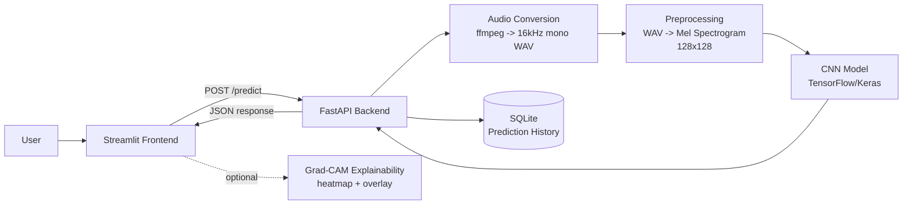

# AI Voice Authenticity Detection System


A full-stack AI system that detects whether a voice sample is **REAL** or **AI-generated** using deep learning (CNN on mel spectrograms), with a **Streamlit frontend** and **FastAPI backend**.

---

## Overview

AI-generated speech and voice cloning tools are increasingly accessible, making it harder to verify whether a voice sample is authentic. This project provides an end-to-end pipeline for **voice authenticity detection** using a CNN trained on **mel-spectrogram images**.

At a high level:

1. Upload an audio file (wav/mp3/m4a/…)
2. Convert audio → 16 kHz mono WAV
3. Convert WAV → mel-spectrogram (rendered as a 128×128 “image”)
4. Run the CNN → return **REAL/FAKE** + confidence
5. Visualize spectrograms and **Grad-CAM** heatmaps for explainability

---

## Features

- Audio upload (common formats) + playback
- Real/Fake prediction
- Confidence score
- Spectrogram visualization
- Grad-CAM heatmap (explainability)
- Batch processing
- Analytics dashboard
- Prediction history logging

---

## Architecture

This project is intentionally decoupled for scalability and clean separation of concerns:

- **Streamlit frontend**: User-facing UI (single prediction, batch prediction, analytics)
- **FastAPI backend**: Inference service exposing HTTP endpoints and writing prediction logs
- **CNN model**: TensorFlow/Keras model trained on mel-spectrogram images
- **SQLite DB**: Stores prediction history (filename, prediction, confidence, timestamp)



---

## Screenshots

**Main UI**


**Analytics Dashboard**

<!-- TODO: Add analytics screenshot (e.g., assets/analytics_dashboard.png) -->

**Grad-CAM Heatmap Output**

<!-- TODO: Add Grad-CAM screenshot (e.g., assets/gradcam_overlay.png) -->

---

## Tech Stack

- Python
- TensorFlow / Keras
- Streamlit
- FastAPI
- SQLite
- Librosa

---

## Model Details

- Spectrogram-based CNN
- Input size: **128×128** (RGB-like mel-spectrogram image)
- Task: **binary classification** (REAL vs FAKE)

---

## Results

**Accuracy (baseline)**

- Validation accuracy: **62.61%**
- Validation samples: **888 images** (from **4447** total images)
- Split: 80/20 using `ImageDataGenerator(validation_split=0.2, seed=42)`

To reproduce the validation metric locally:

```powershell
python -c "import tensorflow as tf; from tensorflow.keras.preprocessing.image import ImageDataGenerator; m=tf.keras.models.load_model('models/cnn_model.keras'); g=ImageDataGenerator(rescale=1/255, validation_split=0.2).flow_from_directory('data/spectrograms', target_size=(128,128), batch_size=32, class_mode='binary', subset='validation', shuffle=False, seed=42); print(m.evaluate(g, verbose=0))"
```

**Observations**

- Treat this metric as a baseline; real-world performance depends heavily on dataset diversity (speakers, microphones, noise) and the types of synthetic voices represented in training.
- Grad-CAM helps validate whether the model is focusing on meaningful spectrogram regions vs. artifacts.


---

## API Endpoints

- `POST /predict` — run inference on an uploaded audio file (multipart field: `file`)
- `GET /history` — return prediction history (most recent first)

Example:

```powershell
curl.exe -X POST -F "file=@data/audio/REAL/1089_134686_000002_000001.wav" http://127.0.0.1:8000/predict
curl.exe http://127.0.0.1:8000/history
```

---

## Setup Instructions

### 1) Install requirements

PowerShell:

```powershell
py -3.12 -m venv .venv
\.venv\Scripts\Activate.ps1
python -m pip install --upgrade pip
pip install -r requirements.txt
```

### 2) Run backend (FastAPI)

From the project root:

```powershell
uvicorn main:app --reload --app-dir api-server
```

Backend runs at: `http://127.0.0.1:8000`

### 3) Run frontend (Streamlit)

In a second terminal:

```powershell
streamlit run app/streamlit_app.py
```

Streamlit runs at: `http://localhost:8501`

---

## Deployment

### Streamlit Cloud (frontend)

- Set the app entrypoint to `app/streamlit_app.py`
- Ensure Python 3.12 is used (this repo includes `runtime.txt`)
- Update `API_BASE_URL` in the Streamlit app to point to your deployed backend

### Railway (backend)

- Deploy the `api-server/` service
- Start command:

```bash
uvicorn main:app --host 0.0.0.0 --port $PORT --app-dir api-server
```

- Optional environment variables:
  - `CORS_ALLOW_ORIGINS` (comma-separated). Default: `*`
  - `PREDICTIONS_DB_PATH` (SQLite path). Default: `api-server/predictions.sqlite3`

---

## Project Structure

```text
ai-authenticity/
├─ api-server/
│  ├─ main.py
│  └─ services/
│     ├─ __init__.py
│     └─ db_service.py
├─ app/
│  └─ streamlit_app.py
├─ assets/
│  └─ app_screenshot.png
├─ data/
│  ├─ audio/
│  │  ├─ FAKE/
│  │  └─ REAL/
│  └─ spectrograms/
│     ├─ FAKE/
│     └─ REAL/
├─ models/
│  ├─ cnn_model.keras
│  └─ cnn_training_history.png
├─ src/
│  ├─ data_loader.py
│  ├─ generate_spectrograms.py
│  ├─ gradcam.py
│  ├─ predict_cnn.py
│  └─ train_cnn.py
├─ requirements.txt
└─ runtime.txt
```

---

## Future Improvements

- Real-time recording
- Better datasets
- Model optimization

---

## Author

Yash Panwar