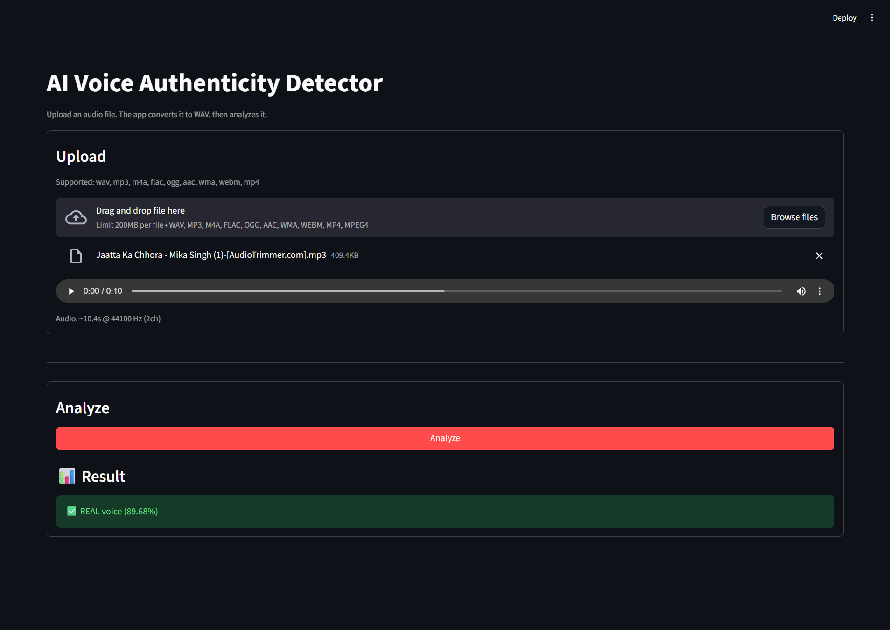
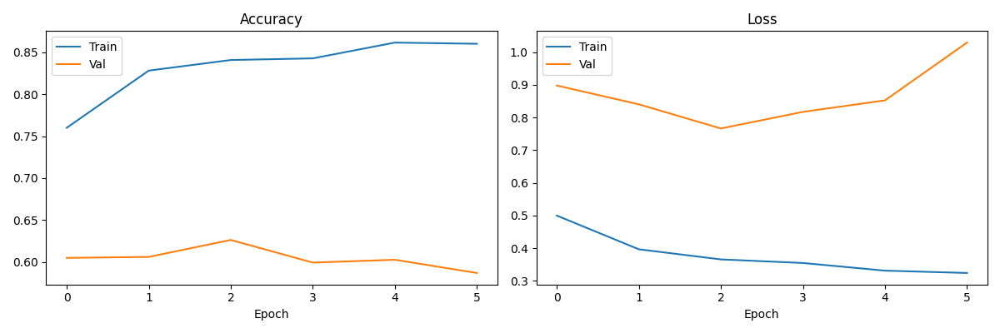

# AI Voice Authenticity Detector (Streamlit + CNN)

This project predicts whether an audio sample is **REAL** or **FAKE** using a CNN trained on **mel‑spectrogram images**, with a simple **Streamlit** UI.

## Screenshot

Add your screenshot file here (cannot be auto-saved from chat):

- Save the screenshot as `assets/app_screenshot.png`

Then it will render below:



## Features

- Upload common audio formats (`.wav`, `.mp3`, `.m4a`, etc.)
- Automatic conversion to WAV (bundled `ffmpeg`)
- One-click prediction with a confidence score

## Requirements

- **Windows** (this repo is currently set up/tested on Windows)
- **Python 3.12** (recommended; TensorFlow is not reliably available on newer prerelease versions)

If you deploy on **Streamlit Community Cloud**, this repo includes `runtime.txt` to force **Python 3.12** (TensorFlow does not install on Python 3.14+).

## Setup

From the project root:

1) Create/activate a virtual environment named `.venv`

PowerShell:

```powershell
py -3.12 -m venv .venv
.\.venv\Scripts\Activate.ps1
```

CMD:

```bat
py -3.12 -m venv .venv
.\.venv\Scripts\activate
```

2) Install dependencies

```powershell
python -m pip install --upgrade pip
pip install -r requirements.txt
```

## Run the App

```powershell
streamlit run app/streamlit_app.py
```

Then open the **Local URL** that Streamlit prints.

The app converts your upload to **WAV** internally before prediction.

Note: very short clips (under ~5 seconds) are **looped during analysis**. This avoids a known failure mode where very short clips are often misclassified.

## How It Works

### 1) Upload → WAV conversion

- The Streamlit app accepts multiple formats.
- If the input is not WAV, it is converted using a bundled `ffmpeg` binary (via `imageio-ffmpeg`).

### 2) WAV → model input

The predictor does the same transformations used during dataset preparation:

- Load audio and resample to **16 kHz**
- Convert to a **mel spectrogram** with **128 mel bands**
- Convert to dB scale (`power_to_db`)
- Render as a **128×128** image (no axes/border)
- Normalize pixels to `[0, 1]`

### 3) CNN prediction

- The CNN is loaded from `models/cnn_model.keras`.
- The model outputs a sigmoid score which is mapped to a label:
	- score close to `1.0` → **REAL**
	- score close to `0.0` → **FAKE**

## Supported Upload Formats

The UI upload allows:

- `wav`, `mp3`, `m4a`, `flac`, `ogg`, `aac`, `wma`, `webm`, `mp4`

If a format fails to convert on your machine, try exporting to `.wav` or `.mp3` and re-upload.

## CLI Prediction (Optional)

You can run predictions without the UI:

```powershell
python -m src.predict_cnn "data/audio/REAL/1089_134686_000002_000001.wav"
```

## Training (Optional)

If you want to retrain the model:

### 1) Prepare data

Place `.wav` files into:

- `data/audio/REAL/`
- `data/audio/FAKE/`

### 2) Generate spectrogram images

```powershell
python -m src.generate_spectrograms
```

This creates:

- `data/spectrograms/REAL/`
- `data/spectrograms/FAKE/`

### 3) Train the CNN

```powershell
python -m src.train_cnn
```

Outputs:

- `models/cnn_model.keras` (model used by the app)
- `models/cnn_training_history.png` (training curves)

### Training Curves



## Project Structure

- `app/streamlit_app.py` — Streamlit UI (upload/convert/analyze)
- `src/predict_cnn.py` — Loads model + converts audio → spectrogram → prediction
- `src/generate_spectrograms.py` — Converts dataset audio into spectrogram PNGs
- `src/train_cnn.py` — Trains and saves the CNN model
- `models/` — Saved model artifacts
- `data/audio/` — Input `.wav` dataset (REAL/FAKE)
- `data/spectrograms/` — Generated spectrogram images (REAL/FAKE)

## Troubleshooting

- **Some formats won’t upload/convert**: try `.wav` or `.mp3` first. Conversion uses a bundled ffmpeg via Python packages; if conversion fails, re-run `pip install -r requirements.txt`.
- **`Model not found`**: confirm `models/cnn_model.keras` exists (or run training to generate it).
- **TensorFlow install issues**: verify you’re using **Python 3.12 (64-bit)** and re-run `pip install -r requirements.txt`.

## Notes / Limitations

- This is a best‑effort classifier. Real-world “AI voice detection” is a hard problem, and accuracy depends heavily on the diversity and quality of the training data.
- If your own recordings are consistently misclassified, the best fix is usually to expand/refresh the dataset (more speakers, recording conditions, and more representative “FAKE” samples) and retrain.

---

Note: This is a best-effort classifier and not a guarantee of authenticity.
